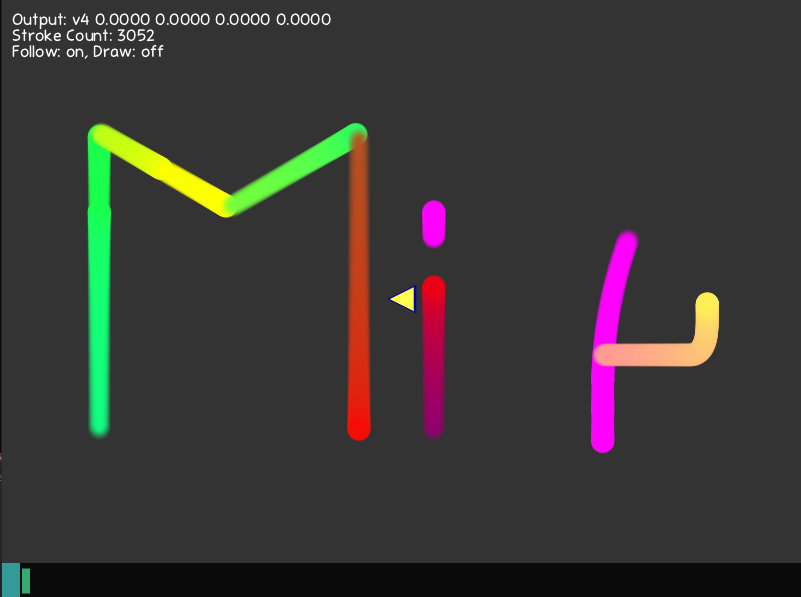

## Michi

'Michi' (道ーみち) means path. This program let's you control the actor by using commands that you enter in graphics console. It is also capable of displaying various internal information about the values and working of the system.

## Documentation
### Actions
* `move: <float>`
* `rotate: <float>`
* `enlarge: <float|vector2>`
* `change: <float|vector2|vector3|vector4>`
* `follow: <on|off>`
* `draw: <on|off>`
* `disp: <position|rotation|scale|color|speed|output|help|expr>`
* `exit`

Example:
```
move: 50
rotate: -90
enlarge: 1, 2
change: 1, 1, 0
follow: on
draw: off
disp: expr
disp: help
disp: output
exit
```

### Variables
* `output` - dynamic variable
* `actor` - struct { position: vector2, rotation: float, scale: vector2, color: vector4 }
* `speed` - struct { position: float, rotation: float, scale: float, color: float }

### Syntax for setting the variables
```
variable: value
```
Example:
```
actor.position: 1, 2
actor.position.x: 5
actor.scale: 2, 2
speed.position: 0.3
actor.color: output.x, .3, .4
```

## Screenshot

